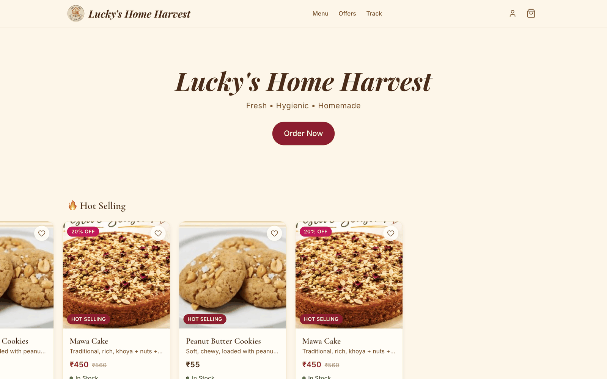
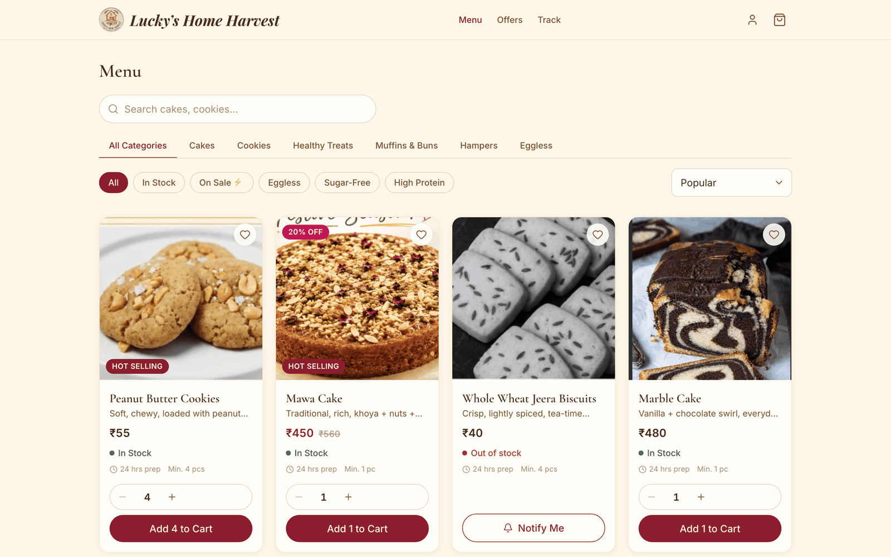
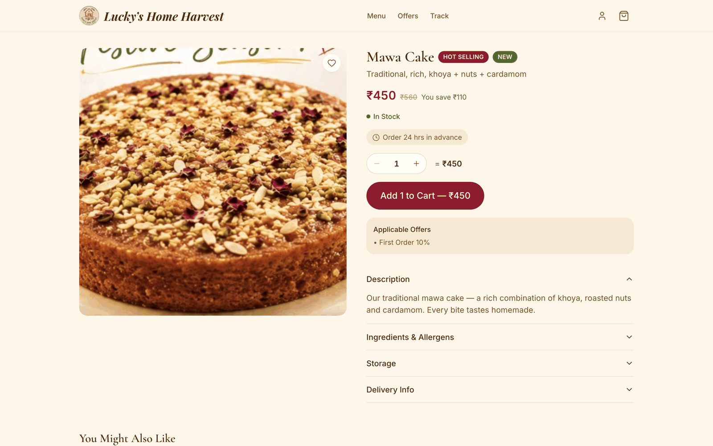
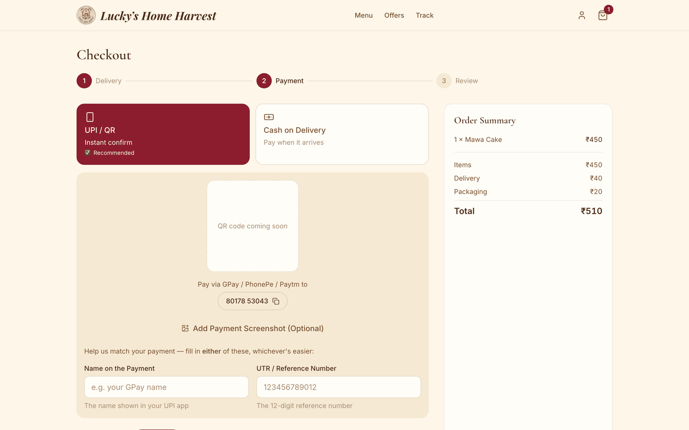
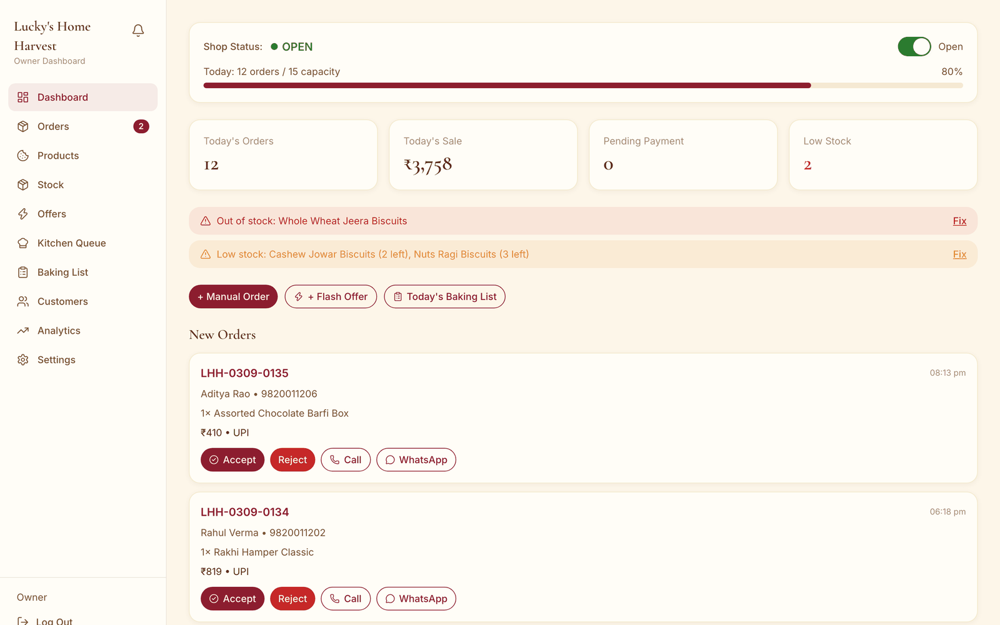
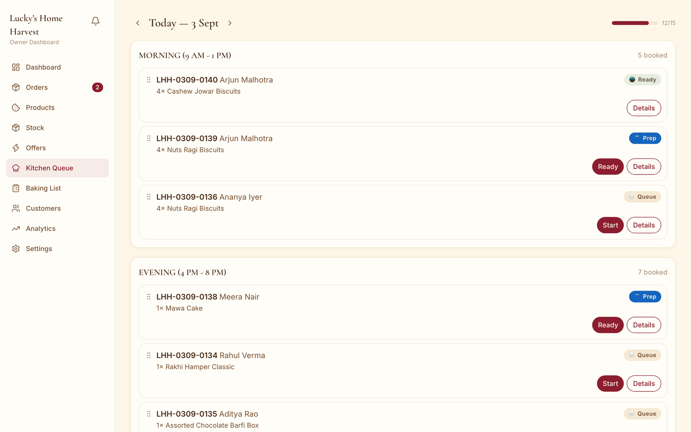
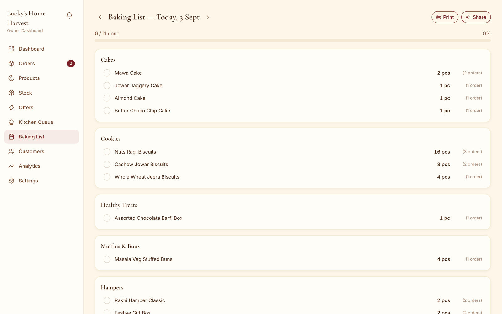
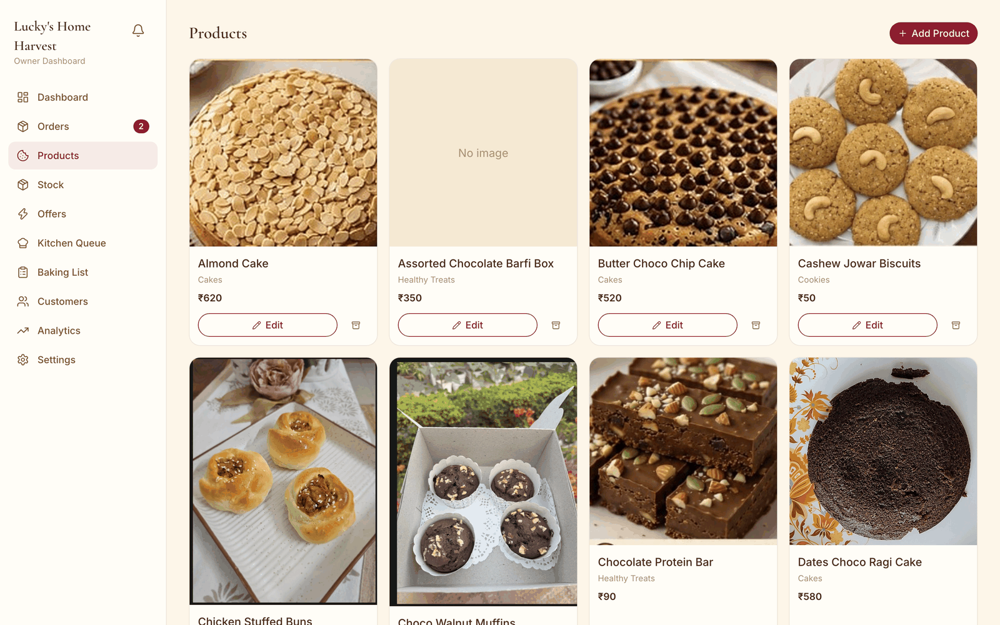
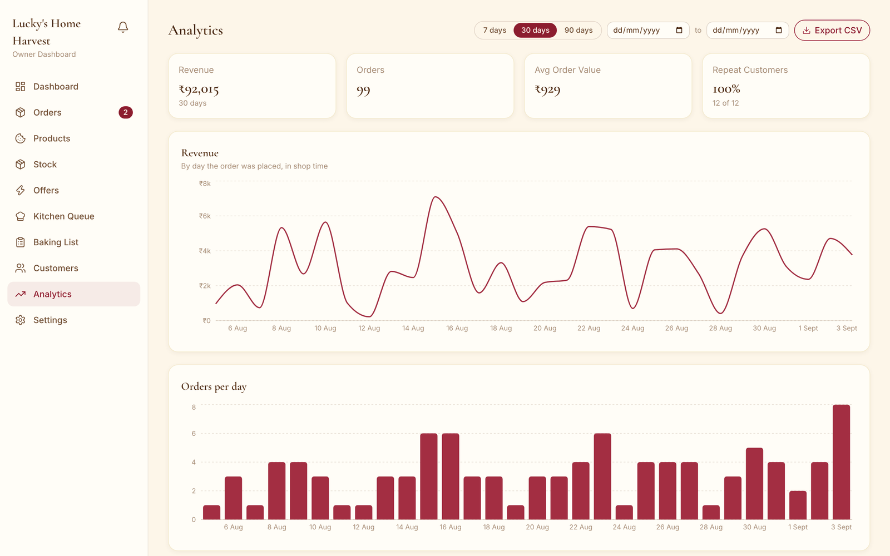
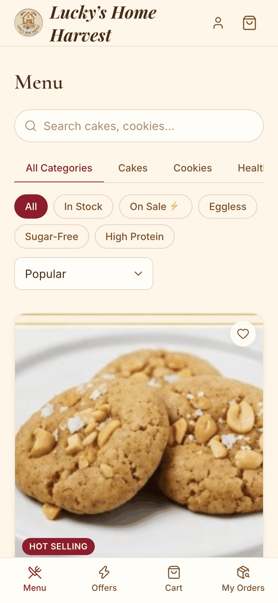

# Lucky's Home Harvest

A full-stack MERN ordering platform for a home bakery — a guest-checkout
storefront for customers and a full operations console for the owner,
built around one hard constraint: **the shop has finite daily/slot baking
capacity, and the site has to enforce that in real time.**

Fresh • Hygienic • Homemade · +91 80178 53043

## Screenshots

Captured from the running app against a seeded database — real orders, real
stock states, real charts.

| Customer | |
|---|---|
|  |  |
|  |  |

| Owner | |
|---|---|
|  |  |
|  |  |
|  |  |

## What it does

**Customer side** — no account required to order:
- Browse by category, filter (in-stock / on-sale / eggless / sugar-free /
  high-protein), search, sort
- Product detail with variants, a quantity stepper clamped to each item's
  `minQty`, and live stock state
- Cart with server-verified pricing — offers, delivery charge, and the
  free-delivery progress bar all come from the same pricing engine
  checkout uses, so the number never changes at the last step
- Checkout wizard: delivery/pickup, date + slot (blocked out by real
  capacity, not just a static calendar), address, UPI deep link + QR or
  COD, order placed as one atomic transaction
- WhatsApp-prefilled order confirmation, live order tracking with polling
  and browser notifications, guest order lookup with no login
- Optional account: order history, reorder-in-one-tap, saved addresses,
  favourites, loyalty points/tier

**Owner side** — the actual operating console:
- Dashboard: today's load vs. capacity, low-stock and payment-to-verify
  alerts, one-tap manual phone orders
- Orders: list + Kanban, drag-and-drop status changes, payment
  verification, cancel-with-stock-reversal
- Kitchen Queue (drag-to-reorder) and an auto-aggregated Baking List —
  every active order's items summed by product, grouped by category,
  printable
- Stock: inline edit, bulk actions, counted vs. daily-capacity modes,
  automatic out-of-stock + customer notification when it hits zero
- Offers: seven discount types, flash campaigns with a live countdown,
  stacking/priority rules, auto-expire cron
- Customers: order history per customer, owner notes, block/unblock
- Analytics: revenue/orders/AOV, top items, category & payment split,
  slot preference, a day×slot peak-time heatmap, offer performance —
  all MongoDB aggregation pipelines bucketed in the shop's own timezone,
  not server UTC
- Settings across shop hours, delivery, payment, offers-defaults, and more

## Why it's non-trivial

A few things this build had to get right that a typical CRUD app doesn't:

- **Capacity-aware availability engine** — the earliest deliverable date
  and open slots are computed live from real prep-time and per-day/per-slot
  capacity, not a static calendar. Every date shown as available in the UI
  is actually bookable.
- **Atomic order placement** — placing an order is one MongoDB replica-set
  transaction: cart re-validated against live prices/stock, a guarded
  conditional decrement (`stockCount: {$gte: qty}`) prevents overselling
  under concurrent orders, and the order snapshots price/name at that
  instant so a later product edit can't rewrite history.
- **Shop-local time, everywhere** — delivery-day math, slot cutoffs, and
  every analytics bucket compute in `SHOP_TIMEZONE` (`Asia/Kolkata` by
  default), not the server's UTC clock — the app runs on Render/Vercel
  (UTC) for a bakery that runs on IST.
- **Offer stacking engine** — auto-applied offers plus an optional code,
  gated by usage limits, first-order/per-customer rules, and priority —
  fully re-validated server-side so a client can never supply its own
  discount amount.
- **Security hardened, not just "add helmet and call it done"** — role-
  separated JWTs with independent secrets and algorithm pinning, rate
  limiting that's actually correct behind a platform proxy (`trust proxy`),
  boot-time env validation that refuses to start on a misconfigured secret,
  server-owned-field stripping against mass assignment, and a cross-domain
  cookie policy (`SameSite=None; Secure` only in production, `Strict`
  locally) needed once client and API live on separate domains.

## Tech stack

**Client:** React 19, Vite, Tailwind CSS, Zustand, React Router, Framer
Motion + Lenis (animation, respecting `prefers-reduced-motion`), Recharts
(lazy-loaded), Axios

**Server:** Node.js, Express, MongoDB + Mongoose (replica-set transactions),
JWT auth, bcrypt, Cloudinary (image upload), node-cron, helmet,
express-rate-limit, express-mongo-sanitize

## Project structure

```
client/   Vite + React customer & owner frontend
server/   Express + Mongoose API
```

See [SPEC.md](./SPEC.md) for the full build spec (design system, data
models, API surface, business logic, phase-by-phase plan) and
[DEPLOYMENT.md](./DEPLOYMENT.md) for the Atlas/Render/Vercel deploy guide.

## Getting started

```bash
# server
cd server
cp .env.example .env   # fill in Mongo URI, JWT secrets, etc.
npm install
npm run seed            # sample categories/products/offers + owner account
npm run dev              # http://localhost:5000

# client
cd client
cp .env.example .env
npm install
npm run dev               # http://localhost:5173
```

The seed script prints the generated owner password once — save it, or set
`OWNER_PASSWORD_HASH` beforehand to choose your own.

## Deploying

MongoDB Atlas + Render (API) + Vercel (client). Full walkthrough, including
a note on why cross-domain auth cookies need `SameSite=None`, is in
[DEPLOYMENT.md](./DEPLOYMENT.md).

---

Contact: +91 80178 53043 · Fresh • Hygienic • Homemade
